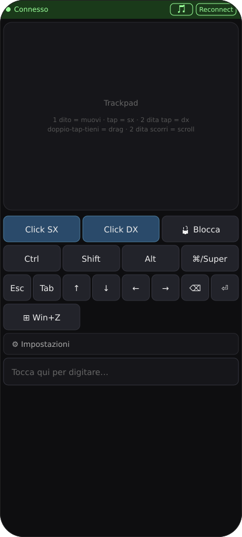
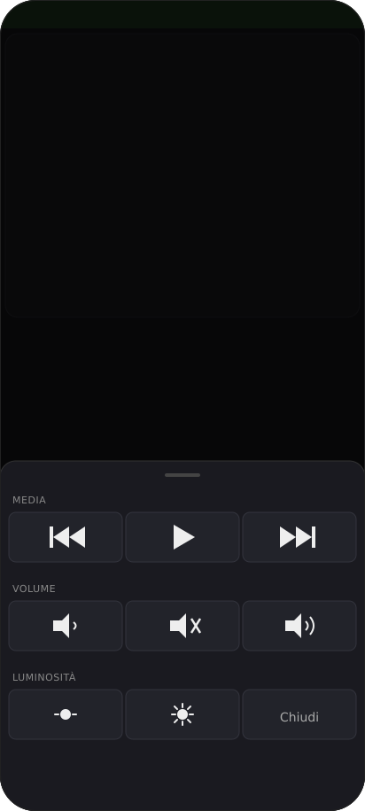
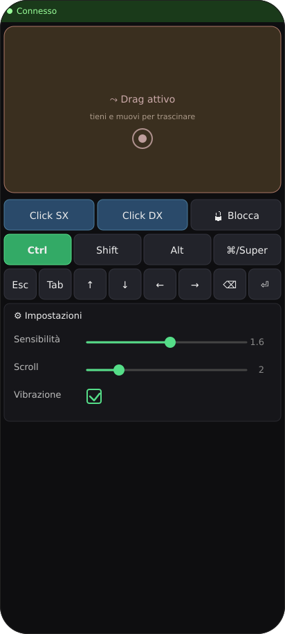
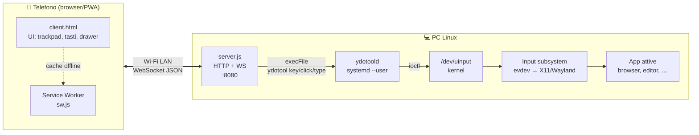
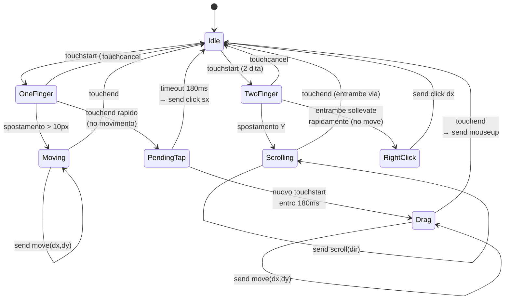
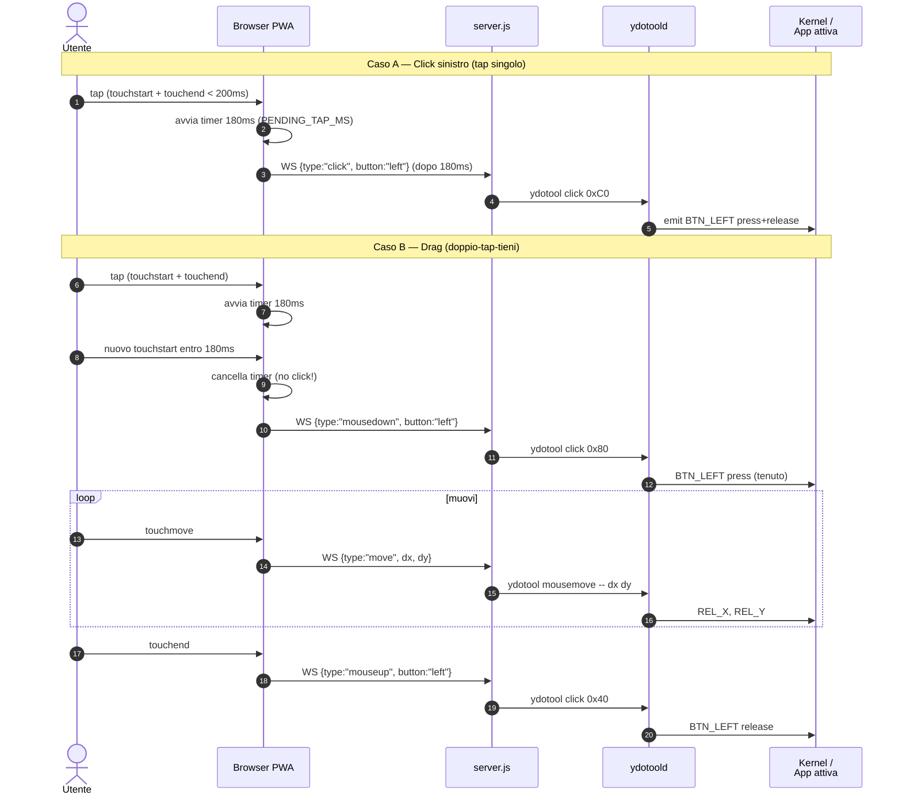

# Phone Remote

> Mi sono rotto la spalla qualche settimana fa. Niente di drammatico — caduta stupida — ma il braccio destro è fuori uso e usare la tastiera del PC è diventato un esercizio masochistico. Tra una visita ortopedica e l'altra avevo bisogno di qualcosa per ammazzare il tempo, così mi sono messo a scrivere questo: il telefono diventa tastiera + trackpad per il PC, via Wi-Fi.

Apri una pagina web sul telefono, sposti il dito, il cursore si muove. Digiti, e il testo arriva. Niente cloud, niente account, tutto in locale. Funziona su Linux (X11 e Wayland) — tutto passa per `ydotool` che lavora a livello kernel via `/dev/uinput`, quindi è indipendente dal display server.

## Caratteristiche

- **Trackpad**: 1 dito = muovi, tap = click sinistro, 2 dita tap = click destro, doppio-tap-tieni = drag, 2 dita scorri = scroll
- **Tastiera**: scrivi sul telefono, arriva sul PC (accenti, simboli, IME inclusi)
- **Modificatori sticky**: Ctrl, Shift, Alt, Super — premili una volta, si applicano al prossimo tasto
- **Tasti media**: in una tendina dedicata — play/pause, prev/next, vol±, mute, brightness±
- **PWA installabile**: aggiungi alla home, funziona offline, niente browser chrome
- **Auto-reconnect** con backoff esponenziale, vibrazione tattile, sensibilità regolabile, lock anti-tap-accidentale

## Screenshot

| Home | Drawer media | Drag + impostazioni |
|---|---|---|
|  |  |  |

> Sono mockup fedeli all'UI (l'ambiente di sviluppo dove ho generato la doc non aveva Chrome headless). Per sostituirli con screenshot reali: scatta dal telefono mentre la PWA è aperta e salva in `docs/screenshot-{home,media,settings}.png`.

## Architettura



Il flusso è semplice: il browser apre un WebSocket verso il server Node sul PC, che traduce i messaggi JSON in chiamate `ydotool`. `ydotoold` parla con `/dev/uinput` e il kernel inietta gli eventi nel layer input, che li distribuisce all'app in foreground (X11, Wayland, console, virtual terminal — qualunque cosa stia leggendo da evdev).

### Macchina a stati del trackpad



Lo stato `PendingTap` è la chiave: un tap singolo viene ritardato di 180ms prima di emettere il click. Se entro quella finestra arriva un secondo touchstart, il click viene cancellato e si entra direttamente in `Drag` con un `mousedown` pulito (senza un click+release intermedio che confonderebbe il window manager).

### Sequenza tap vs drag



## Protocollo WebSocket

Tutti i messaggi sono JSON. Direzione: client → server.

| `type`      | Campi                                | Effetto |
|-------------|--------------------------------------|---------|
| `move`      | `dx`, `dy` (int)                     | Sposta cursore relativo |
| `click`     | `button` (`left`/`right`/`middle`)   | Press + release |
| `mousedown` | `button`                             | Solo press (per drag) |
| `mouseup`   | `button`                             | Solo release |
| `scroll`    | `dy` (int, ±1 per tick)              | Ruota la wheel |
| `type`      | `text` (stringa)                     | Inserisce testo (UTF-8) |
| `key`       | `key` (es. `"Enter"`), `mods` (array, es. `["Control","Shift"]`) | Combo tastiera |

I codici tasto sono mappati in `KEYCODES` dentro `server.js` (scancode Linux input). Tasti media inclusi: `PlayPause`, `Mute`, `VolumeUp/Down`, `BrightnessUp/Down`, ecc.

## Setup

```bash
./setup.sh
```

Lo script rileva la distro e fa tutto:
- installa `ydotool`, `nodejs`, `npm`
- aggiunge l'utente ai gruppi `input` e `video`
- crea la udev rule per `/dev/uinput`
- crea e abilita il servizio user `ydotoold.service` (systemd)
- aggiunge `YDOTOOL_SOCKET` ai file rc della shell
- esegue `npm install`
- apre 8080/tcp su `firewalld` o `ufw` se attivi

**La prima volta serve logout + login** per applicare i gruppi `input`/`video`.

### Distro supportate

| Famiglia | Distro testate | Package manager |
|---|---|---|
| Arch    | Arch, Manjaro, EndeavourOS              | `pacman` |
| Debian  | Debian, Ubuntu, Mint, Pop!_OS           | `apt` |
| RHEL    | Fedora, RHEL, CentOS, Rocky, AlmaLinux  | `dnf` (fallback `yum`) |
| SUSE    | openSUSE Leap/Tumbleweed, SLES          | `zypper` |
| Alpine  | Alpine                                  | `apk` |
| Void    | Void Linux                              | `xbps-install` |

Distro non in lista: lo script lo segnala, tu installi manualmente `ydotool nodejs npm` e rilanci.

### Requisiti

- Kernel con `uinput` (qualunque kernel moderno)
- systemd con sessione user (o avvia `ydotoold` a mano — lo script ti dà il comando)
- Node.js ≥ 16
- Telefono e PC sulla stessa rete Wi-Fi

## Uso

```bash
npm start
```

Lo script ti dice l'IP. Dal browser del telefono apri `http://<IP-PC>:8080`. Sui browser mobili moderni vedi "Aggiungi alla schermata Home": diventa una PWA con icona dedicata.

## Note

- **Niente autenticazione**: chiunque sia sulla tua Wi-Fi può connettersi. Su rete domestica fidata va bene, su rete pubblica no.
- **Tasti media**: usano gli scancode XF86 standard. Funzionano se il tuo desktop environment li intercetta (GNOME, KDE, sway con bindsym, ecc.). Su WM minimali potresti dover aggiungere binding manuali.
- **Luminosità su monitor esterno**: gli scancode `BrightnessUp/Down` funzionano sui laptop; per monitor esterni serve qualcosa tipo `ddcutil` (non incluso).
- **Latenza**: ogni move spawna `ydotool` come processo. Su una LAN tipica si avvertono ~10-20ms. Per ridurre, ydotool potrebbe essere sostituito da una libreria nativa (`node-uinput`) — non strettamente necessario per l'uso quotidiano.

## File del progetto

```
.
├── server.js              # HTTP + WebSocket + bridge a ydotool
├── client.html            # PWA: UI, gestione touch, WS client
├── sw.js                  # Service worker per offline/install
├── manifest.webmanifest   # Manifest PWA
├── setup.sh               # Installer multi-distro
├── package.json
└── docs/
    ├── screenshot-*.png   # Screenshot (o mockup)
    └── diagrams/          # Sorgenti mermaid (.mmd)
```

## Licenza

MIT (fai quello che vuoi).
